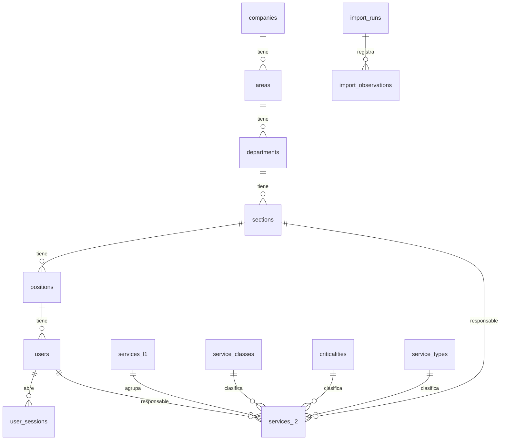

# RESOLUCIÓN — Catálogo de Servicios de TI

> Estado: las pruebas se ejecutaron con el **Excel real**, primero en un sandbox sin Docker (SQLite y PostgreSQL 16 con apt) y el 2026-10-04 también con **Docker** (Docker 29.7.2, Compose v5.4.0, Windows 11): servicio `tests`, `smoke.py flow` y `persistence_check.sh` salieron con código 0 (§8).

## 1. Problema, alcance y supuestos
Sistematizar el catálogo del Excel y añadir usuarios y estructura organizacional con autenticación local. Sin tickets, facturación ni consumo.
Supuestos: la jerarquía es fija (Empresa→Área→Departamento→Sección→Puesto→Usuario); el padre de una unidad no se cambia; el importador es la fuente de verdad solo de los campos del Excel; las reglas del importador se diseñaron desde el enunciado y se verificaron después contra el archivo real (`docs/contexto/02-analisis-excel.md`).

## 2. Arquitectura y tecnologías
Flask 3 + SQLAlchemy 2 + Alembic + PostgreSQL 16 + gunicorn; SPA en JavaScript puro servida por Flask; Docker Compose (db, app; perfiles `test` y `ui`). Elegidas por simplicidad, cero dependencias de IA/terceros en ejecución y reproducibilidad. Autorización centralizada en `app/security.py::guard_request` (defecto-denegar).

## 3. Modelo de datos

Diccionario resumido (PK `id` entero en todas):

| Tabla | Campos clave / restricciones |
|---|---|
| companies | `code` UNIQUE, name, is_active |
| areas / departments / sections / positions | code, name, is_active, FK al padre NOT NULL; UNIQUE(padre, code) |
| users | `username` UNIQUE (minúsculas), password_hash (scrypt+sal), role CHECK('admin','consulta'), is_active, `position_id` FK NOT NULL |
| user_sessions | token_hash UNIQUE (SHA-256), csrf_token, user_id FK, expires_at |
| service_classes / criticalities / service_types | name UNIQUE, sort_order, is_active |
| services_l1 | `code` UNIQUE, code_original, name, is_active, source_sheet/range/notes |
| services_l2 | `code` UNIQUE, code_original, name, level1_id FK NOT NULL, activo_excel CHECK(S/N/NULL), activo_raw, class/criticality/type FK NULL, description, metric, min/max_value NUMERIC NULL con CHECK(min≤max), section_id FK NULL, responsible_user_id FK NULL, is_active, review_status CHECK(ok/revisar), source_* |
| import_runs / import_observations | resumen y SHA-256 del archivo; observaciones con tipo, fila, código y evidencia JSON |

La empresa de un usuario se deriva de su puesto (no hay FK redundante). La regla «responsable pertenece a la sección» se valida en el servidor (no es expresable como FK simple).

## 4. Mapeo Excel → base de datos e importación
A,B → `services_l1(code,name)` · C,D → `services_l2(code,name)` · E → `activo_excel/activo_raw` · F,G,H → FK a catálogos (coincidencia sin mayúsculas/tildes; corrección registrada como `mapeo_etiqueta`; valor desconocido → NULL + `valor_fuera_de_catalogo`) · I → description · J → metric · K,L → min/max (no numérico → NULL + observación; ausente ≠ 0).
Reglas R1–R7: ver `app/importer.py` y `docs/contexto/02-analisis-excel.md`. Casos: celdas combinadas (R1/R2), SE.12 (nombre canónico configurable + evidencia), códigos como texto (R6), atributos incompletos (`revisar`), filas de continuación/listas (R4 y zona `E112:H122` reconocida), trazabilidad (hoja/rango/filas, SHA-256, observaciones por corrida).
Resultado real (SHA-256 `de3b478a…cf0`): 12 N1 / 46 N2; 58 creados; 8 observaciones (filas 42 y 67 sin código no asignadas; SE.12 con nombre canónico «Suministrar Analitica» porque «Mantener Tableros de Control» es el N2 SE.12.3; SE.12.1–.3 en `revisar`; N1 de SE.12.3 inferido por prefijo). Detalle en `docs/contexto/02-analisis-excel.md`.
Reporte: `import_runs` (creados/actualizados/omitidos/observados, N1/N2, control 12/46) visible en la pantalla Importación.

## 5. Autenticación y autorización
Hash scrypt con sal (Werkzeug); sesión en servidor (tabla `user_sessions`), cookie firmada HttpOnly/SameSite=Lax con solo el token; logout y desactivación de usuario invalidan la sesión; CSRF por cabecera `X-CSRF-Token`; verificación de contraseña en tiempo constante frente a usuarios inexistentes; admin no puede desactivarse ni quitarse el rol si es el último.

## 6. Evidencias de las tres técnicas
- Context engineering: `AGENTS.md`, `docs/contexto/` (índice por fase, 2 actualizaciones justificadas en `CAMBIOS.md`).
- Prompt engineering: `docs/prompts/` — **incompleto: se usaron realmente los prompts 01 y 03; los prompts 04–07b quedan como plantillas pendientes y no se presentan como usados.**
- Harness engineering: `docs/evidencias/harness-ciclo-01..03.md`, `scripts/check.sh`, `smoke.py`, `persistence_check.sh`, límites en AGENTS.md §3.
Commits: el historial de Git del repositorio (`git log`); el desarrollo no se versionó por fase, por lo que no hay un commit por cada versión del contexto.

## 7. Matriz requisito → implementación → prueba

| Req. | Implementación | Prueba | Tipo |
|---|---|---|---|
| P01 login | `api/auth.py`, `security.authenticate` | `test_auth::test_P01…`, hash salado | integración |
| P02 sin sesión/logout/inactivo | `guard_request`, `UserSession` | `test_P02…`, `test_desactivar_usuario_revoca_sesiones` | integración |
| P03 consulta no modifica | `guard_request` | `test_P03…` | integración |
| P04 jerarquía y usuario | `api/org.py` | `test_org::test_P04…` | integración |
| P05 duplicados/referencias | validaciones | `test_P05…` (org y servicios) | integración |
| P06 importar original 12/46 | `importer.py` | `test_import::test_P06…` (se omite sin el archivo) | integración |
| P07 repetir importación | upsert por código | `test_P07…` | integración |
| P08 SE.12 y ausentes | `_pick`, mapeo | `test_P08…`, `test_mapeos…` (sintético) | integración |
| P09 min>max | `_l2_values`, CHECK | `test_P09…` | integración |
| P10 búsqueda/filtros | `list_l2` | `test_P10…` | integración |
| P11 responsable de otra sección | `_l2_values` | `test_P11…` | integración |
| P12 persistencia | volumen `pgdata` | `test_persistence` (en proceso) + `persistence_check.sh` (Docker) | integración / E2E |
| UI | `static/app.js` | `tests/ui/ui_smoke.js` | E2E (jsdom) |
| Migraciones | Alembic | `test_migrations` | integración |

## 8. Resultados reales de pruebas

| Fecha | Comando | Entorno | Commit | Resultado |
|---|---|---|---|---|
| 2026-10-04 | `pytest -q` | SQLite, Excel real | sin commit (sandbox previo a Git) | 31 passed (incluye P06 y P08 reales) |
| 2026-10-04 | `pytest -q` con `TEST_DATABASE_URL` | PostgreSQL 16 (apt, sin Docker), Excel real | sin commit (sandbox previo a Git) | 31 passed |
| 2026-10-04 | `ruff check .` | — | sin commit (sandbox previo a Git) | All checks passed |
| 2026-10-04 | `EXPECT_REAL_CONTROL=1 python scripts/smoke.py flow` | gunicorn + PostgreSQL 16, Excel real | sin commit (sandbox previo a Git) | todos OK; control 12/46 = true; 2.ª importación sin cambios |
| 2026-10-04 | `node tests/ui/ui_smoke.js` | sistema real, Excel real | sin commit (sandbox previo a Git) | UI OK |
| 2026-10-04 | `docker compose --profile test run --rm --build tests` | Docker (ruff + pytest contra `db_test`) | ver nota | All checks passed · **31 passed** · CONTROLES OK (exit 0) |
| 2026-10-04 | `docker compose exec -T app python scripts/smoke.py flow` (antes de `setup_eval.sh`) | Docker | ver nota | **falló**: «No se pudo iniciar sesión como admin» (cuentas de evaluación aún no creadas) |
| 2026-10-04 | `sh scripts/setup_eval.sh` | Docker | ver nota | admin_demo y consulta_demo creados; importación #1: creados=58, observados=8, N1=12, N2=46, coincide=true |
| 2026-10-04 | `docker compose exec -T -e EXPECT_REAL_CONTROL=1 app python scripts/smoke.py flow` | Docker, Excel real | ver nota | todos OK; control 12 N1 / 46 N2; 2.ª importación idempotente |
| 2026-10-04 | `sh scripts/persistence_check.sh` | Docker | ver nota | P12 OK: el marcador sobrevivió a `docker compose restart` |

Nota de commit: las ejecuciones se hicieron sobre el árbol de trabajo publicado en el primer commit completo del repositorio (posterior a `32df9b4`, que solo contenía el README); no hubo commits intermedios por fase. El fallo de `smoke.py` se debió al orden de ejecución (requiere `setup_eval.sh` antes) y está documentado en `docs/evidencias/harness-ciclo-04.md`.

Fallos encontrados y corregidos: `docs/evidencias/harness-ciclo-01..03.md`.

## 9. Docker, persistencia y recuperación
Ver README. Volumen `pgdata`; `docker compose down` conserva datos; `down -v` es el reinicio destructivo. El arranque espera a PostgreSQL (healthcheck + `depends_on: service_healthy` + reintentos de migración). El Excel se monta `:ro`.

## 10. Limitaciones, aportes y reflexión
- Docker verificado el 2026-10-04 (§8). No se ejecutaron `ui_tests` en Docker ni la prueba de clon limpio desde la etiqueta.
- No se admite reasignar el padre de una unidad; la paginación del selector de usuarios/secciones llega a 500 registros.
- Sin recuperación de contraseña ni bloqueo por intentos fallidos.
- Aportes del integrante: `COMPLETAR`.
- Reflexión (borrador a revisar con sus palabras): la IA produjo código funcional pero sus propias pruebas contenían una expectativa errónea (ciclo 01); un bug de DOM solo apareció al ejecutar la interfaz (ciclo 02) y un bloqueo solo en PostgreSQL (ciclo 03). Decisiones humanas: no inventar el contenido del Excel, bajas lógicas con cascada explícita y tratar el texto del Excel como dato no confiable.
